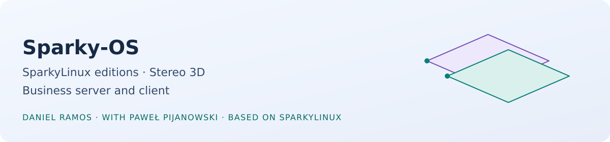

<picture>
  <source media="(prefers-color-scheme: dark)" srcset="./assets/banner-dark.svg">
  <source media="(prefers-color-scheme: light)" srcset="./assets/banner-light.svg">
  
</picture>

# Sparky-OS

This is where [Daniel Ramos](https://github.com/danielcamposramos) (Capitain Jack) keeps his [SparkyLinux](https://sparkylinux.org) work, built together with Paweł "pavroo" Pijanowski, who created SparkyLinux.
It started in 2018 with a small-business server and workstation line.
It now also holds the plan for a stereo 3D edition.

[SparkyLinux](https://sparkylinux.org) · [github.com/sparkylinux](https://github.com/sparkylinux) · [Daniel on GitHub](https://github.com/danielcamposramos)

## People

| | |
| --- | --- |
|  | **Daniel Ramos (Capitain Jack)** Electrical engineer, builds the stereo edition and the business editions.  |
|  | **Paweł "pavroo" Pijanowski** Creator of SparkyLinux, whose tools and releases everything here builds on.  |

## Sparky Stereo OS

**Sparky Stereo OS 9 "Mashtabba", based on Debian 14 "Forky".**
It is an edition of SparkyLinux created by Paweł Pijanowski and Daniel Ramos, with stereo 3D built in from the kernel to the desktop.
Mashtabba is "the Twins", the Babylonian name of the star pair that Greeks later called Castor and Pollux.
Paweł names each Sparky generation after a sky object that is also a myth, and a twin pair fits a stereo picture.

What it brings:

- **3D output modes in the system:** KWin lists and labels every stereo mode, and the desktop shows in both eyes.
- **Windowed and fullscreen 3D:** a window or a game declares its packing and eye order, and KWin draws each eye.
- **Stereo players and games:** 3D video playback, and Source-engine games with stereo HUD and menus.
- **Drivers:** the NVIDIA open kernel modules with our patches, and the AMD closed driver as a choice.
- **A stereo AppCenter:** APTus Stereo AppCenter keeps Paweł's APTus AppCenter untouched and adds a stereo section on top.
- **More than packages:** stereo photo library, stereo wallpapers, stereo screensavers and DLNA with 3D signalling.
- **Brazilian certificates:** sparky-ca for ICP-Brasil roots, tokens and smart cards.

**Status: in development.**
The first ISO is not published yet.
The packages, the patched kernel and the ISO are built in a development VM, and nothing here is a release.

## Business editions

Server and client editions come after the stereo edition.
Their first target is Brazil's justice system, lawyers and the financial world, with PJeOffice and certificates as must-haves.
The server side is a Samba 4 Active Directory domain controller installer with backup, time sync and service supervision.
The client side joins a workstation to that domain.
The code in the repositories below is from the Debian 9 and 10 era.
It will be ported to Debian 14 after the stereo edition.

## Repositories

**Stereo edition**

The stereo work is developed in Daniel's own repositories for now, and the packages will move here when the edition is published.

| Repository | What it is |
| --- | --- |
| [sparky-aptus-stereo-appcenter](https://github.com/danielcamposramos/sparky-aptus-stereo-appcenter) | A fork of Paweł's APTus AppCenter that adds the stereo section and leaves the original untouched. |
| [kwin](https://github.com/danielcamposramos/kwin) | KWin fork carrying the stereo 3D output work. |
| [open-gpu-kernel-modules](https://github.com/danielcamposramos/open-gpu-kernel-modules) | NVIDIA open kernel modules fork for stereo output. |

**Business editions**

| Repository | What it is |
| --- | --- |
| [sparky-server](https://github.com/Sparky-OS/sparky-server) | The post-install configuration dialog for the server edition. |
| [sparky-ad-server](https://github.com/Sparky-OS/sparky-ad-server) | Installer for a Samba 4 Active Directory domain controller. |
| [sparky-ad-client](https://github.com/Sparky-OS/sparky-ad-client) | Joins a workstation to an Active Directory domain, plus a service manager. |
| [sparky-ntp-server](https://github.com/Sparky-OS/sparky-ntp-server) | Time sync by country over the WAN, and a time server for the LAN. |
| [sparky-server-run](https://github.com/Sparky-OS/sparky-server-run) | Checks and starts missing services. |
| [sparky-meta-server](https://github.com/Sparky-OS/sparky-meta-server) | Meta package that pulls in the server prerequisites. |
| [sparky-server-doc](https://github.com/Sparky-OS/sparky-server-doc) | Documentation and notes for the small-business server. |

**Tools and artwork**

| Repository | What it is |
| --- | --- |
| [sparky-beep](https://github.com/Sparky-OS/sparky-beep) | Sound announcements for running services, with Debian packaging. |
| [sparky-ca](https://github.com/Sparky-OS/sparky-ca) | A window to install CA certificates into the system, a fork of Paweł's tool. |
| [SparkyBlack](https://github.com/Sparky-OS/SparkyBlack) | The Sparky black KDE theme, with SDDM and Plymouth themes. |

## Related work

- [awesome-stereoscopy](https://github.com/danielcamposramos/awesome-stereoscopy): a CC0 list of stereoscopic 3D tools and evidence.
- [awesome-linux-hdr](https://github.com/danielcamposramos/awesome-linux-hdr): a CC0 map of HDR and deep-colour support on Linux.
- [sony-bravia-linux](https://github.com/danielcamposramos/sony-bravia-linux): stereoscopic playback and HDMI work on pre-Android BRAVIA televisions.
- [source-sdk-2013](https://github.com/danielcamposramos/source-sdk-2013): the stereo fork of Valve's Source SDK.
- Stereo and display forks: [linux](https://github.com/danielcamposramos/linux), [vlc](https://github.com/danielcamposramos/vlc), [mpv](https://github.com/danielcamposramos/mpv), [plasma-wayland-protocols](https://github.com/danielcamposramos/plasma-wayland-protocols), [gamescope](https://github.com/danielcamposramos/gamescope).
- [Daniel's profile](https://github.com/danielcamposramos) for everything else.

## How this relates to SparkyLinux

SparkyLinux is Paweł Pijanowski's distribution, and everything here builds on it.
Sparky Stereo OS is an edition of SparkyLinux, not a replacement for it.
Sparky's own tools, repositories and release names stay Paweł's, and our packages depend on them rather than copy them.
Where we change something upstream, we say so and send it to [SparkyLinux](https://github.com/sparkylinux) when it fits.
Daniel has volunteered with SparkyLinux since December 2018, with Bash scripting, artwork and Portuguese-speaking support.

Most repositories are GPL-3.0, and the ones that still lack a licence file are getting one.
